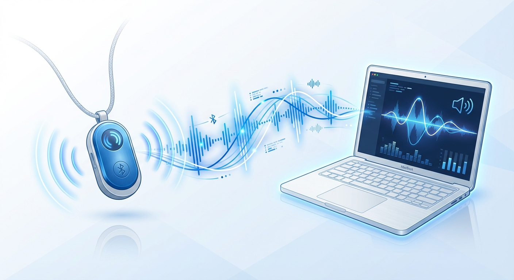

# Omi Audio Recorder

A macOS application for recording audio from Omi wearable devices via Bluetooth Low Energy (BLE). Captures Opus-encoded audio streams in real-time and saves them as WAV files.

[](https://opensource.org/licenses/MIT)
[](https://www.python.org/downloads/)
[](https://www.apple.com/macos/)



## Features

- **Auto-discovery mode** - Automatically finds your Omi device, no configuration needed
- **Real-time audio capture** from Omi wearable devices
- **Voice-activated recording** with automatic session segmentation
- **Multiple recording modes** (continuous, manual, interactive)
- **Opus to WAV conversion** with high-quality decoding
- **Real-time visual feedback** showing recording progress and audio levels
- **Automatic transcription** - Batch convert recordings to markdown with Whisper
- **Offline transcription** - Works without internet once model is cached
- **Simple setup** with minimal dependencies

## Quick Start

```bash
# Install dependencies
brew install opus
python3 -m venv venv && source venv/bin/activate
pip install bleak

# Run continuous recorder with auto-discovery
# (No need to manually find or edit device UUID!)
uv run src/omi_continuous_recorder.py
```

✨ **New Feature:** Auto-discovery mode automatically finds your Omi device. No hardcoding needed!

## Installation

See [docs/INSTALL.md](docs/INSTALL.md) for detailed installation instructions.

### Requirements

- macOS 11+ (Big Sur or later)
- Python 3.8+
- Homebrew
- Omi wearable device

### Quick Setup

```bash
# Clone repository
git clone <repository-url>
cd omi-clean

# Install Opus codec
brew install opus

# Create and activate virtual environment
python3 -m venv venv
source venv/bin/activate

# Install Python dependencies
pip install bleak

# Discover your Omi device UUID
uv run src/discover_omi.py
```

## Usage

### Recording

Automatically discovers your Omi device and records with voice activity detection:

```bash
# Auto-discovery mode (recommended)
uv run src/omi_continuous_recorder.py

# Optional: Specify device UUID manually
uv run src/omi_continuous_recorder.py B6B3A95D-FAC4-E984-0E50-8924A6F36529
```

**Features:**
- Auto-discovers Omi devices (scans for 10 seconds)
- If multiple devices found, prompts you to select one
- Starts recording when speech is detected
- Saves to a new file after 3 seconds of silence
- Creates separate files for each speech segment
- Real-time progress bar showing recording status
- Press `Ctrl+C` to stop gracefully

See [docs/USAGE.md](docs/USAGE.md) for comprehensive usage guide.

## Documentation

| Document | Description |
|----------|-------------|
| [INSTALL.md](docs/INSTALL.md) | Installation and setup guide |
| [USAGE.md](docs/USAGE.md) | Usage guide with examples |
| [ARCHITECTURE.md](docs/ARCHITECTURE.md) | Technical architecture |
| [CLAUDE.md](CLAUDE.md) | AI assistant instructions |

## Project Structure

```
omi-recorder/
├── src/
│   ├── config.py                  # Configuration loader
│   ├── discover_omi.py            # Device discovery utility
│   ├── omi_continuous_recorder.py # Voice-activated recorder
│   ├── transcribe.py              # Transcription module
│   └── batch_transcribe.py        # Batch transcription script
├── config.example.yaml        # Example configuration file
├── docs/
│   ├── ARCHITECTURE.md        # Technical documentation
│   ├── INSTALL.md             # Installation guide
│   └── USAGE.md               # Usage guide
├── assets/                    # Documentation assets
└── omi_recordings/            # Output directory (created on first run)
```

## Configuration

**Device Discovery:** Automatic! The continuous recorder will auto-discover your Omi device via BLE. No need to hardcode UUIDs.

**Optional: Customize settings** by creating a `config.yaml` file in the project root:

```bash
# Copy the example config
cp config.example.yaml config.yaml

# Edit to customize
nano config.yaml
```

**Available settings:**

```yaml
recording:
  silence_threshold: 500    # Voice detection sensitivity (lower = more sensitive)
  silence_duration: 3.0     # Seconds of silence before auto-saving
  min_recording_duration: 1.0  # Minimum recording length to save

transcription:
  model: base               # Whisper model: tiny, base, small, medium, large
  language: ""              # Language code or empty for auto-detect

directory:
  recordings_dir: omi_recordings    # Where WAV files are saved
  transcripts_dir: omi_recordings   # Where markdown transcripts are saved

device:
  discovery_timeout: 10.0   # BLE scan timeout in seconds
```

All settings are optional - defaults work out of the box. The config file is gitignored for personal customization.

## Technical Specifications

| Specification | Value |
|---------------|-------|
| Audio Codec | Opus |
| Sample Rate | 16 kHz |
| Channels | Mono |
| Output Format | WAV (PCM 16-bit) |
| Protocol | Bluetooth Low Energy (BLE) |

## Transcription

Automatically transcribe all recordings to markdown files with metadata:

```bash
# Batch transcribe all new recordings
uv run src/batch_transcribe.py

# Re-transcribe all files (even if .md exists)
uv run src/batch_transcribe.py --force

# Use a different Whisper model (tiny, small, medium, large)
uv run src/batch_transcribe.py --model small

# Transcribe from a custom directory
uv run src/batch_transcribe.py --dir /path/to/recordings

# Save transcripts to a separate directory
uv run src/batch_transcribe.py --transcripts-dir /path/to/transcripts
```

**Features:**
- Automatically generates markdown files alongside WAV files
- Includes audio metadata (duration, file size, sample rate)
- Whisper base model (~140MB) cached locally for offline use
- Skips already-transcribed files by default
- Progress bar during batch processing
- Works completely offline once model is cached

Each recording generates a markdown file with:
```markdown
# Recording: omi_auto_20260120_143022

## Metadata
- **Recorded:** 2026-01-20 14:30:22
- **Duration:** 8.5s
- **File Size:** 265.3 KB
- ...

## Transcription
[Transcribed text from Whisper]
```

See [docs/USAGE.md](docs/USAGE.md#transcription) for complete transcription guide.

## Troubleshooting

### Device not found

1. Ensure Omi is powered on
2. Check Bluetooth is enabled on Mac
3. Run `src/discover_omi.py` to verify UUID

### Opus library not found

```bash
brew install opus
```

### No audio captured

- Speak directly into the Omi device
- Check device battery level
- Verify correct UUID in script

See [docs/USAGE.md](docs/USAGE.md#troubleshooting) for more solutions.

## Contributing

Contributions are welcome! Please feel free to submit a Pull Request.

1. Fork the repository
2. Create your feature branch (`git checkout -b feature/amazing-feature`)
3. Commit your changes (`git commit -m 'Add amazing feature'`)
4. Push to the branch (`git push origin feature/amazing-feature`)
5. Open a Pull Request

## License

This project is licensed under the MIT License - see the [LICENSE](LICENSE) file for details.

```
MIT License

Copyright (c) 2025 Ronen Artzi

Portions based on the Omi project by Based Hardware Contributors
Original Omi project: https://github.com/BasedHardware/omi
Original License: MIT (Copyright (c) 2024 Based Hardware Contributors)

Permission is hereby granted, free of charge, to any person obtaining a copy
of this software and associated documentation files (the "Software"), to deal
in the Software without restriction, including without limitation the rights
to use, copy, modify, merge, publish, distribute, sublicense, and/or sell
copies of the Software, and to permit persons to whom the Software is
furnished to do so, subject to the following conditions:

The above copyright notice and this permission notice shall be included in all
copies or substantial portions of the Software.

THE SOFTWARE IS PROVIDED "AS IS", WITHOUT WARRANTY OF ANY KIND, EXPRESS OR
IMPLIED, INCLUDING BUT NOT LIMITED TO THE WARRANTIES OF MERCHANTABILITY,
FITNESS FOR A PARTICULAR PURPOSE AND NONINFRINGEMENT. IN NO EVENT SHALL THE
AUTHORS OR COPYRIGHT HOLDERS BE LIABLE FOR ANY CLAIM, DAMAGES OR OTHER
LIABILITY, WHETHER IN AN ACTION OF CONTRACT, TORT OR OTHERWISE, ARISING FROM,
OUT OF OR IN CONNECTION WITH THE SOFTWARE OR THE USE OR OTHER DEALINGS IN THE
SOFTWARE.
```

## Acknowledgments

- [Based Hardware](https://github.com/BasedHardware/omi) - Omi device and SDK
- [Bleak](https://github.com/hbldh/bleak) - Bluetooth Low Energy library
- [Opus Codec](https://opus-codec.org/) - Audio codec

## Resources

- [Omi Documentation](https://docs.omi.me/)
- [Omi GitHub](https://github.com/BasedHardware/omi)
- [Omi Protocol Docs](https://docs.omi.me/doc/developer/Protocol)
